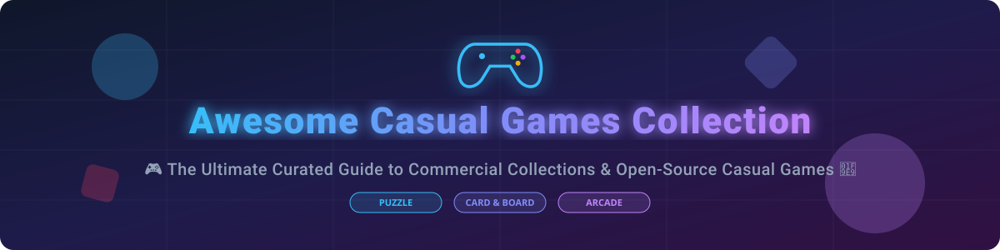

# 🎮 Awesome Casual Games Collection

  

      

---

## 🌟 Overview

Welcome to the **Awesome Casual Games Collection** repository! This curated directory features top **commercial casual game collections**, **SaaS casual gaming portals**, and **open-source GitHub projects**. Whether you are looking for classic puzzle games, multiplayer card titles, strategy board games, or lightweight retro arcade fun, this index provides comprehensive insights into features, pricing models, free tier limits, company revenue/valuation rankings, and open-source star metrics.

**Last updated: October 2026**

---

## 📑 Table of Contents

- [🏢 Commercial & SaaS Casual Game Collections](#-commercial--saas-casual-game-collections)
- [🔓 Open-Source GitHub Projects](#-open-source-github-projects)
  - [⚡ Top Open-Source Repositories (Ranked by Stars)](#-top-open-source-repositories-ranked-by-stars)
  - [📦 Multi-Game & Engine Collections](#-multi-game--engine-collections)
- [🤝 How to Contribute](#-how-to-contribute)
- [💖 Support](#-support)
- [📈 Star History](#-star-history)
- [⚠️ Disclaimer](#%EF%B8%8F-disclaimer)

---

## 🏢 Commercial & SaaS Casual Game Collections

The global casual gaming market is estimated at **$22.5 Billion** and is **moderately fragmented**, with major platform giants (Nintendo, EA, Microsoft) coexisting with specialized digital subscriptions and portals.

| Product Name | Pricing (Starting Paid Tier) | Free Tier Limits / Trial | Company Size (Revenue / Valuation) | Key Features & Description | Target Audience |
| :--- | :--- | :--- | :--- | :--- | :--- |
| **[Microsoft Casual Games](https://zone.msn.com/en-us/microsoft-casual-games)** 🎮 | $1.99/month (Premium Ad-Free) | Free forever with ad support | $245.1 Billion Revenue (Microsoft) | Collection of classic casual games including Solitaire, Minesweeper, Mahjong, and Jigsaw. | Windows users wanting familiar classics. |
| **[PopCap Party Pack / EA Casual Games](https://www.ea.com/games/popcap)** 🌻 | $5.99/month (EA Play subscription) | 10-day / 10-hour free trial via EA Play | $7.56 Billion Revenue / $38B Valuation (EA) | Iconic collection of PopCap's polished casual games including Bejeweled, Peggle, Zuma, and Plants vs. Zombies. | Fans of polished puzzle and arcade titles. |
| **[Clubhouse Games: 51 Worldwide Classics](https://www.nintendo.com/store/products/clubhouse-games-51-worldwide-classics-switch/)** 🎲 | $39.99 (One-time purchase) | Free "Local Companion Edition" demo with 4 games | $12.0 Billion Revenue / $55B Valuation (Nintendo) | Comprehensive collection of 51 board, card, and table games with local and online multiplayer. MobyGames score: 7.8/10. | Switch owners wanting diverse classic games. |
| **[Pogo Games](https://www.pogo.com/)** 🃏 | $6.99/month (Club Pogo) | Free forever with ad support & locked premium titles | $7.56 Billion Revenue (EA) | EA's online casual games portal featuring Solitaire, Mahjong, Word Whomp, with social chat and badges. | Online casual gamers wanting social features. |
| **[Big Fish Games Collection](https://www.bigfishgames.com/)** 🐟 | $6.99/month (Game Club Membership) | Free trial (1 hour per game trial limit) | $500 Million Revenue (Aristocrat / Big Fish) | Subscription-based collection of casual games including hidden object, puzzle, and time management titles. | Players wanting a rotating library of puzzle games. |
| **[WildTangent Games](https://www.wildtangent.com/)** 🚀 | $6.99/month (WildCoins Subscription) | Free trial (25 WildCoins bonus on signup / ad play) | $80 Million Revenue | Casual game portal with a vast library of downloadable and browser-based games. | Windows users wanting broad casual titles. |
| **[GameHouse Casual Club](https://www.gamehouse.com/)** 🏠 | $10.99/month (GameHouse Original Stories) | 7-day full access free trial | $45 Million Revenue (RealNetworks) | Subscription service offering unlimited access to time management, puzzle, and story-driven casual games. | Players wanting story & time-management games. |
| **[PlayFirst Collection](https://www.playfirst.com/)** 🍳 | $2.99 (One-time purchase per title) | 60-minute free trial per game | $25 Million Revenue (Glu Mobile / EA) | Collection featuring Diner Dash and iconic casual time management and simulation games. | Fans of time management and simulation games. |
| **[MSN Games Collection](https://zone.msn.com/en-us/games)** 🌐 | $1.99/month (MSN Premium Ad-Free) | Free forever with ad support | Included in Microsoft ($245.1B Rev) | Web-based casual games portal featuring Solitaire, Mahjong, Crosswords, and quick-play puzzles. | Browser players needing quick play. |
| **[Hoyle Card Games](https://www.hoylegames.com/)** ♠️ | $19.99 (One-time purchase) | Free demo version with 3 playable games | $10 Million Revenue | Long-running series of card game collections featuring Poker, Bridge, Euchre, Hearts, and interactive tutorials. | Card game enthusiasts wanting teaching tools. |

---

## 🔓 Open-Source GitHub Projects

The open-source casual games ecosystem is **diverse, privacy-respecting, and production-proven**, spanning web, desktop, and mobile platforms without tracking or ads.

### ⚡ Top Open-Source Repositories (Ranked by Stars)

All open-source repositories below are sorted in descending order by GitHub star count:

| Repository & Link | Stars Badge | Key Description & Features | Platform / Tech Stack | License |
| :--- | :--- | :--- | :--- | :--- |
| **[Ren'Py Visual Novel Engine](https://github.com/renpy/renpy)** 📚 |  | Open-source engine for visual novels and story-driven casual games. Powers 8,000+ published titles worldwide. | Python / Cython | MIT |
| **[PvZ-Portable](https://github.com/wszqkzqk/PvZ-Portable)** 🧟 |  | Cross-platform reimplementation of Plants vs. Zombies (GOTY edition) with portable `.v4` binary saves across x86_64, ARM, RISC-V, and LoongArch. | C++ / CMake | GPL-3.0 |
| **[AlexGames](https://github.com/alexbarry/AlexGames)** ♟️ |  | Web-accessible suite of 15+ classic games (Solitaire, Chess, Go, Reversi, Minesweeper, Backgammon, Word Mastermind) with Lua plugin support and WebSocket multiplayer. | Lua / Rust / WebAssembly | MIT |
| **[JMines](https://github.com/stephanebruckert/JMines)** 💣 |  | Java-based remake of the classic 1on1 Minesweeper Flags multiplayer game originally hosted on MSN Games. | Java | MIT |
| **[cards2.0](https://github.com/T1mmos/cards2.0)** 🎴 |  | Nostalgic open-source multiplayer remake of MSN Messenger's Solitaire Showdown card game. | JavaScript / Node.js | MIT |
| **[Chogan](https://github.com/choganhq/chogan)** 🛡️ |  | Privacy-focused offline collection for Android containing Tower Defence, Sudoku, Minesweeper, and Dots & Boxes. Zero network permissions, reproducible F-Droid builds. | Dart / Flutter | MIT |
| **[Fair Games](https://apps.apple.com/dk/app/fair-games/id6761661340)** 📱 |  | Free, ad-free iOS casual game collection (Block Blast, Sirtet, Flappy Bird, Breakout, Sudoku, 2048) built with Skip cross-platform Swift tools. | Swift / Skip | Open Source |
| **[Ace of Penguins](https://packages.debian.org/ja/buster/ace-of-penguins)** 🐧 |  | Penguin-themed solitaire and puzzle suite for Linux containing 12 classic titles (Canfield, Freecell, Golf, Solitaire, Spider, Taipei). | C / X11 | GPL-2.0 |
| **[Solitaire Pack -- Lite](https://apps.apple.com/bs/app/solitaire-pack-lite/id648930700)** 🃏 |  | Mobile-optimized suite of 6 Solitaire variations (Klondike, Spider, FreeCell, Tri-Peaks, Pyramid) with touch controls and move-only scoring. | Swift / Mobile | Open Source |

---

### 📦 Multi-Game & Engine Collections

- **Visual Novel & Narrative Engines**: **[Ren'Py Engine](https://github.com/renpy/renpy)** (8,000+ games created, open-source Python engine).
- **Web & Desktop Multi-Game Suites**: **[AlexGames](https://github.com/alexbarry/AlexGames)** (15+ web games, multiplayer, Lua scripting).
- **Privacy-First Android Collections**: **[Chogan](https://github.com/choganhq/chogan)** (Offline Sudoku, Tower Defense, Minesweeper; zero telemetry).
- **Ad-Free iOS Arcade Packages**: **[Fair Games](https://apps.apple.com/dk/app/fair-games/id6761661340)** (Block Blast, 2048, Flappy Bird, Tetris style).
- **Linux Classic Solitaire**: **[Ace of Penguins](https://packages.debian.org/ja/buster/ace-of-penguins)** (12 penguin-themed desktop games).
- **Nostalgic Remakes**: **[PvZ-Portable](https://github.com/wszqkzqk/PvZ-Portable)**, **[JMines](https://github.com/stephanebruckert/JMines)**, **[cards2.0](https://github.com/T1mmos/cards2.0)**.

---

## 🤝 How to Contribute

We welcome community contributions! Please follow these simple guidelines:

1. 🍴 **Fork** this repository.
2. 📝 **Add or update** entries in `README.md` following the formatted Markdown tables.
3. 🔎 **Ensure details** include accurate pricing, free tier limits, links, and license information.
4. 🚀 **Submit a Pull Request** with a brief summary of your updates.

Check out our meta awesome list: [Awesome-Awesome-Awesome](https://github.com/ishandutta2007/Awesome-Awesome-Awesome) for more curated lists.

---

## 💖 Support

If you find this casual games directory useful, please consider supporting the project:

- ⭐ **Star** this repository on GitHub to help others discover it.
- 🔀 **Fork** and share it with fellow casual gamers and open-source advocates.
- ☕ **Sponsor / Buy me a Coffee**: Show your appreciation on the [GitHub Sponsor Dashboard](https://github.com/sponsors/ishandutta2007).

Thank you for your support and happy gaming! 🎉

---

## 📈 Star History

---

## ⚠️ Disclaimer

- This is a **community-curated directory** and does not constitute an endorsement.
- Casual game clients may collect telemetry or user data; always review privacy policies before installing mobile or desktop software.
- Open-source implementations are community projects maintained independently of original commercial IP holders.
